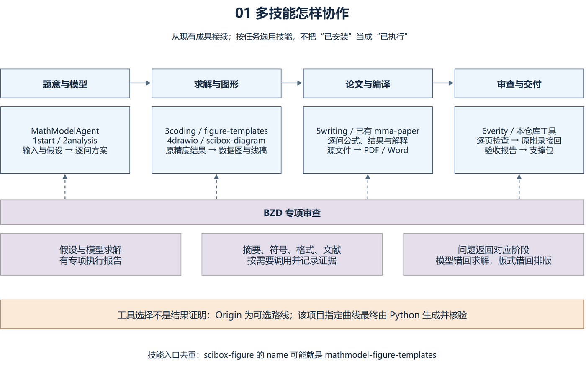
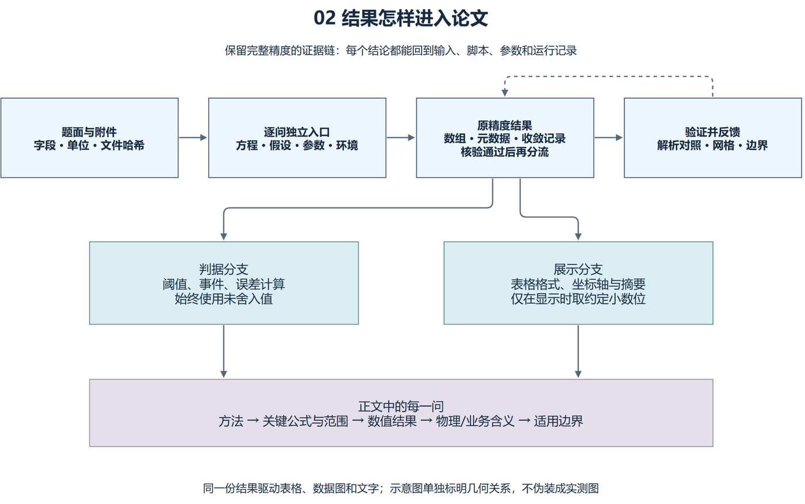
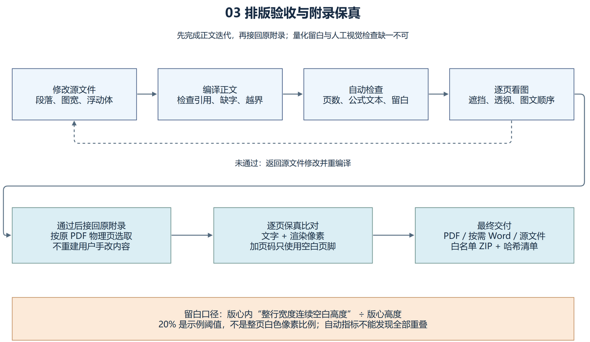

# 数模论文迭代定稿 Skill

一个从实际中文数学建模论文多轮修订中提炼的 Codex skill：将逐问求解证据、摘要与公式、科研图表、教材式物理线稿、分页优化、原附录保留及支撑材料验收连接起来。

它接续 **MathModelAgent、sci-box、BZD 专项审查、项目已有的 mma-paper** 等技能。不是把它们重新打包：完整的分工、实际使用证据、可选工具与历史版本见 [技能协作说明](references/skill-orchestration.md)。

**先体验：**安装依赖后运行 `python scripts/run_demo.py --output qa/demo`，得到合成计算结果、正文检查、保留原附录的 PDF 和支撑压缩包。详细命令、预期输出、真实项目迁移与失败处理见 [复现手册](references/reproduction-guide.md)。

## 三张图看懂流程

### 1. 技能协作



MathModelAgent 组织建模与写作，sci-box 处理图形，BZD 提供专项审查，本技能串起反馈和交付。已部署的技能不一定都已运行。

### 2. 从计算到论文的证据链



判据使用完整精度，展示按约定舍入；表格、图形与摘要来自同一份经过验证的结果。

### 3. 排版、原附录与交付



三图均提供 [可编辑 draw.io 源](docs/figures) 和 [生成脚本](scripts/generate_diagrams.py)，重绘与导出见 [复现手册第 7 节](references/reproduction-guide.md#7-重绘本仓库的三张讲解图)。

## 安装与调用

将仓库克隆到 Codex 的技能目录（Windows 默认位于用户目录下 `.codex/skills`，或使用自己的 `$CODEX_HOME/skills`）：

```sh
git clone https://github.com/sunzhejian/mathmodel-paper-workflow-skill.git ~/.codex/skills/mathmodel-paper-workflow
```

使用脚本需要 Python 3.10+：

```sh
python -m pip install -r requirements.txt
```

新任务中调用：

> 使用 $mathmodel-paper-workflow，根据我指定的最新版论文和求解结果继续修改。正文四边 2.5 cm，摘要、正文、AI 声明和文献最多 31 页；附录内容不动，补连续页码。检查公式、图文遮挡及超过 20% 的页尾连续留白。

这是示例配置；页数、边距与阈值遵循具体用户和比赛要求，不是固定标准。可与已有数学建模技能配合，也可独立使用。

## 内容

| 文件 | 用途 |
| --- | --- |
| [SKILL.md](SKILL.md) | 入口、反馈处理与完成标准 |
| [技能协作](references/skill-orchestration.md) | 其他技能的分工、证据等级、调用顺序、同名去重 |
| [复现手册](references/reproduction-guide.md) | 环境、端到端演示、真实项目迁移、图源重绘 |
| [历史版本锁](examples/upstream-lock.json) | 4 个公开上游的来源与当时提交 |
| [约束合同示例](examples/workflow-contract.json) | 页数口径、边距、留白、附录与交付约定 |
| [证据与写作](references/evidence-and-writing.md) | 数值追溯、摘要、逐问模型、符号及文献 |
| [图表与排版](references/figures-and-layout.md) | 中文字体、可见图宽、线稿透视、标注避让、留白 |
| [编译与交付](references/build-and-delivery.md) | 原附录接回、PDF/Word验收及支撑包 |
| [PDF 工具](scripts/pdf_workflow.py) | 留白/公式检查、渲染、附录保留和可选页码 |
| [支撑包工具](scripts/package_support.py) | 显式白名单、路径检查、哈希与 ZIP 回读 |
| [可运行合成案例](scripts/run_demo.py) | 独立计算、正反例检查、附录拼接、打包回读 |
| [核验记录](docs/validation.md) | 本轮测试、讲解图检查与自动验收边界 |

```sh
python scripts/pdf_workflow.py audit paper.pdf --last-page 31 --blank-limit 20 --report qa/layout.json --render-dir qa/pages
python scripts/pdf_workflow.py append body.pdf original.pdf final.pdf --appendix-start 30 --report qa/appendix.json
python scripts/package_support.py support-root support-files.json support.zip
python -m unittest discover -s tests -v
python scripts/run_demo.py --output qa/demo
```

完整参数：`python scripts/pdf_workflow.py --help`，或对子命令执行 `--help`。

## 检查边界

- 留白指标是**版心内整行宽度的连续空白高度比例**，不是全部白色像素面积。它不能代替人工检查遮挡、图号或公式正确性。
- PDF 公式扫描可能误报，需要查看渲染页；自动检测只覆盖指定正文范围。
- 保留附录指页面可见内容与文字的比对，不保证数字签名、书签或表单等文档级特性。
- 加页码只接受空白页脚；遇到已有内容直接停止，不覆盖旧页码。
- 仓库仅包含通用流程、工具和合成测试，不包含任何竞赛论文、附件、队伍信息或计算数据。

工具使用 PyMuPDF、NumPy 和 Pillow；依赖各自许可证适用。仓库原创说明与代码采用 MIT 许可证。
