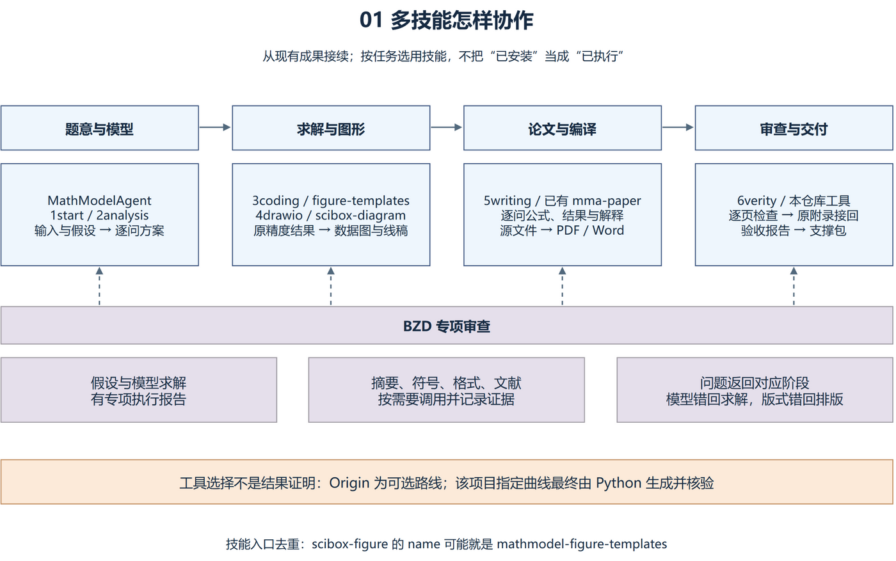
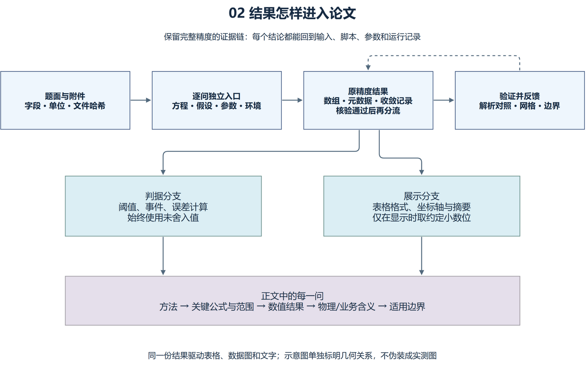
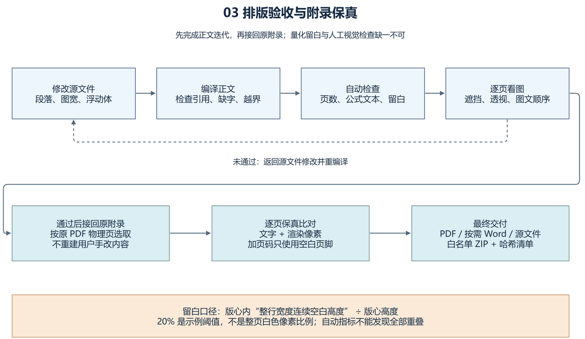

# 数学建模论文与材料工作流 Skill

面向中文数学建模竞赛的 Codex skill：可以**从题面和附件开始完成模型、求解、论文及相关材料**，也可以接续现稿，只修论文、审查模型、制作图示或处理排版。工作围绕逐问证据展开，将程序与原精度结果、摘要与公式、数据图和线稿、分页优化、附录保留及支撑材料验收连接起来。缺少题面、数据或运行证据时会标明缺口，不把演示结果写进正式论文。

它接续 **MathModelAgent、sci-box、BZD 专项审查、EditaPlot、项目已有的 mma-paper** 等技能。前四个上游项目已作为固定提交的 Git 子模块放入 [vendor](vendor/README.md)；`mma-paper` 没有已核验的公开来源，继续使用项目自带版本。完整分工与实际使用证据见 [技能协作说明](references/skill-orchestration.md)。

**第一次使用：**先看[工具安装与第一次使用](docs/toolchain.md)，装好 Git、Python 和本仓库依赖后，用同一个虚拟环境解释器运行 `scripts/run_demo.py --output qa/demo`。演示会生成合成计算结果、正文检查、保留原附录的 PDF 和支撑压缩包；它不需要 MATLAB、COMSOL、Stata、Origin、Office 或 LaTeX。详细产物及真实项目迁移见[复现手册](references/reproduction-guide.md)。

## 三张图看懂流程

### 1. 技能协作



MathModelAgent 组织建模与写作，sci-box 处理图形，BZD 提供专项审查，本技能串起反馈和交付。已部署的技能不一定都已运行。

### 2. 从计算到论文的证据链



判据使用完整精度，展示按约定舍入；表格、图形与摘要来自同一份经过验证的结果。

### 3. 排版、原附录与交付



三图均提供 [可编辑 draw.io 源](docs/figures) 和 [生成脚本](scripts/generate_diagrams.py)，重绘与导出见 [复现手册第 7 节](references/reproduction-guide.md#7-重绘本仓库的三张讲解图)。

## 安装与调用

将仓库克隆到 Codex 的技能目录（Windows 默认位于用户目录下 `.codex/skills`，也可使用自己的 `CODEX_HOME/skills`）：

```sh
git clone --recurse-submodules https://github.com/sunzhejian/mathmodel-paper-workflow-skill.git ~/.codex/skills/mathmodel-paper-workflow
```

上面的路径写法适用于 macOS/Linux shell。**Windows PowerShell 请直接照[安装指南的 Windows 命令](docs/toolchain.md#windows-powershell)执行**，不必把 `~` 或 Bash 语法硬搬过去。已克隆旧版仓库时，在仓库根目录执行 `git submodule update --init --recursive`。运行 `python scripts/check_vendor_skills.py` 检查四个上游提交和 12 个选用入口。子模块文件在本地可读，但不会自动注册为顶层 Codex skill；按当前阶段读取对应 `SKILL.md`。

使用脚本需要 Python 3.10+。先按[安装指南](docs/toolchain.md#1-先把仓库演示跑通)创建 `.venv`；下面只示范从该环境安装依赖：

```powershell
# Windows PowerShell
.\.venv\Scripts\python.exe -m pip install -r requirements.txt
```

```sh
# macOS / Linux
.venv/bin/python -m pip install -r requirements.txt
```

这一步只安装仓库验收脚本所需的 PyMuPDF、NumPy 和 Pillow。真正求解赛题时，按方案另装 SciPy、pandas、Matplotlib、openpyxl 等；选 LaTeX、Typst、draw.io 或 Word 路线时再装对应工具。每项的官方入口、验证命令和第一次使用示例都在[工具安装指南](docs/toolchain.md)，**不用为了运行演示把所有软件装一遍**。

新稿或大幅改版且方向未定时，先提供六项单选：继续修改现稿、用已有求解结果写论文、**从零到完整论文及相关材料全交付**、只审查现稿、只制作图示、只修排版。选定后核对缺少的材料和交付范围，再运行 python scripts/template_inventory.py --project-root 项目目录 --category paper --configured-family，展示当前赛事的论文变体；需要流程图时再运行同一命令的 --category diagram，向使用者询问合适版式。示意图候选按用途筛选为五带路线、三栏框架、三栏阶段流程或横版任务流水线；有参考图时可选择自定义重绘。数据图模板只有与真实结果结构匹配时才推荐，不能使用其中的模拟数据充当论文结果。选项文案与使用条件见[首轮问询](references/template-selection.md)。

选择“从零到完整论文及相关材料全交付”时，流程依次为：**题面与附件核对 → 每问建模与独立求解 → 原精度结果和图表 → 论文与可编辑源 → 编译、审查、支撑包验收**。通常会有论文 PDF、要求的 Word/源文件、逐问代码、电子结果表、图源、运行记录和支撑包；实际清单以本次比赛规则和用户要求为准。只修现稿时从相应阶段接续，不重做已验证的全部工作。

国赛 CUMCM 匿名正文保留真正的论文标题，但不显示题号、参赛队号抬头。赛题号和队号仍可留在项目配置中；`pdf_workflow.py audit --cumcm-anonymous --project-config ...` 可对编译后的 PDF 做文字层检查，首页仍需目视核对。

新任务中调用：

> 使用 $mathmodel-paper-workflow，根据我指定的最新版论文和求解结果继续修改。正文四边 2.5 cm，摘要、正文、AI 声明和文献最多 31 页；附录内容不动，补连续页码。检查公式、图文遮挡及超过 20% 的页尾连续留白。

从零开始时也可直接说：“使用 $mathmodel-paper-workflow，选第 3 项。根据我提供的赛题与附件，完成逐问求解、论文 PDF 与可编辑版本、代码、电子结果及要求的支撑材料；先核对缺少的材料和比赛规则。”

这是示例配置；页数、边距与阈值遵循具体用户和比赛要求，不是固定标准。可与已有数学建模技能配合，也可独立使用。

## 内容

| 文件 | 用途 |
| --- | --- |
| [SKILL.md](SKILL.md) | 入口、反馈处理与完成标准 |
| [技能协作](references/skill-orchestration.md) | 其他技能的分工、证据等级、调用顺序、同名去重 |
| [上游项目文件](vendor/README.md) / [入口清单](vendor/skill-integrations.json) | 固定提交的实际文件、所选技能路径和许可边界 |
| [上游技能检查](scripts/check_vendor_skills.py) | 核对四个子模块提交、入口文件及 frontmatter 名称 |
| [上游更新检测](scripts/check_upstream_updates.py) | 只读比较四个上游 HEAD 与当前固定提交，供定期维护使用 |
| [上游维护步骤](references/upstream-maintenance.md) | 发现更新后的差异审查、兼容性检查、提交和异常处理 |
| [复现手册](references/reproduction-guide.md) | 环境、端到端演示、真实项目迁移、图源重绘 |
| [工具安装与第一次使用](docs/toolchain.md) | Git/Python 基础环境，数值库、LaTeX/Typst、draw.io、Word 与可选商业软件 |
| [历史版本锁](examples/upstream-lock.json) | 4 个公开上游的来源与当时提交 |
| [约束合同示例](examples/workflow-contract.json) | 页数口径、边距、留白、附录与交付约定 |
| [合同检查入口](scripts/audit_contract.py) | 直接读取合同，校验范围并运行 PDF 检查；支持 dry-run |
| [修订细则](references/revision-playbook.md) | 反馈定位、逐问公式、摘要、图片宽度与同版本验收 |
| [失败恢复](references/failure-recovery.md) | 14 类常见故障的定位、修改和复验动作 |
| [修订记录](assets/revision-record.md) / [逐问证据表](assets/question-evidence.csv) | 多轮修订时按需复制使用 |
| [证据与写作](references/evidence-and-writing.md) | 数值追溯、摘要、逐问模型、符号及文献 |
| [证据驱动扩写](references/longform-paper.md) | 用户要求最低页数时的内容预算与页数范围验收 |
| [模板选择](references/template-selection.md) / [模板盘点](scripts/template_inventory.py) | 向使用者询问论文和流程图模板，区分数据图的实际适用性 |
| [模板决策校验](scripts/validate_template_decisions.py) | 保存用户选择后验证模板与数据源，后续修订避免重复询问 |
| [流程图模板对照图](scripts/preview_diagram_templates.py) | 从子模块预览生成本地四图对照，供使用者选择，不发布上游素材 |
| [图表与排版](references/figures-and-layout.md) | 中文字体、可见图宽、线稿透视、标注避让、留白 |
| [编译与交付](references/build-and-delivery.md) | 原附录接回、PDF/Word验收及支撑包 |
| [PDF 工具](scripts/pdf_workflow.py) | 留白/公式检查、渲染、附录保留和可选页码 |
| [支撑包工具](scripts/package_support.py) | 显式白名单、路径检查、哈希与 ZIP 回读 |
| [交付一致性门禁](scripts/verify_delivery.py) | 核对正文、附录来源、最终 PDF、检查报告及支撑 ZIP 属于同一版 |
| [论文口吻筛查](scripts/check_paper_voice.py) | 在 TeX/Markdown 源中标出明显的工作过程用语，供人工复核 |
| [可运行合成案例](scripts/run_demo.py) | 独立计算、正反例检查、附录拼接、打包回读 |
| [核验记录](docs/validation.md) | 本轮测试、讲解图检查与自动验收边界 |
| [人工验收情景](examples/acceptance-scenarios.md) | 十九种典型反馈的预期行为与失败判据；供实际评估时使用 |

```sh
python scripts/pdf_workflow.py audit paper.pdf --last-page 31 --blank-limit 20 --report qa/layout.json --render-dir qa/pages
python scripts/pdf_workflow.py audit body.pdf --min-pages 21 --max-pages 31 --report qa/range.json
python scripts/pdf_workflow.py append body.pdf original.pdf final.pdf --appendix-start 30 --report qa/appendix.json
python scripts/package_support.py support-root support-files.json support.zip
python scripts/verify_delivery.py body.pdf original.pdf final.pdf qa/layout.json qa/appendix.json --support-zip support.zip --support-root support-root
python -m unittest discover -s tests -v
python scripts/run_demo.py --output qa/demo
```

完整参数：`python scripts/pdf_workflow.py --help`，或对子命令执行 `--help`。

## 检查边界

- 留白指标是**版心内整行宽度的连续空白高度比例**，不是全部白色像素面积。它不能代替人工检查遮挡、图号或公式正确性。
- PDF 公式扫描可能误报，需要查看渲染页；自动检测只覆盖指定正文范围。
- 保留附录指页面可见内容与文字的比对，不保证数字签名、书签或表单等文档级特性。
- 加页码只接受空白页脚；遇到已有内容直接停止，不覆盖旧页码。
- 仓库仅包含通用流程、工具和合成测试，不包含任何竞赛论文、附件、队伍信息或计算数据。

工具使用 PyMuPDF、NumPy 和 Pillow；依赖各自许可证适用。仓库原创说明与代码采用 MIT 许可证。
